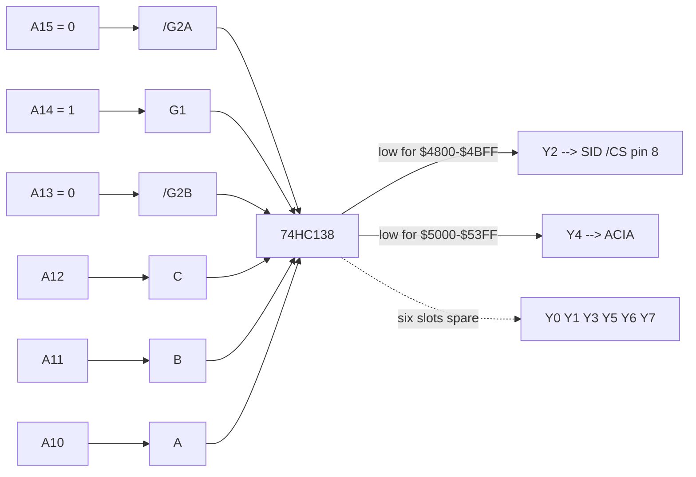

# BE6502 Build Notes — Memory Map & Address Decoding

Ben Eater 6502 (W65C02S) + Worlds Worst Video Card + Fast SD interface
+ W65C51 ACIA + **SIDKick pico at `$4800`**.

---

## Memory map

```
        +===========================================+
$FFFF   |                                           |
        |   ROM   28C256 EEPROM   32K               |
        |                                           |
        |     $F700  WozMon + Fast Binary Load      |
        |     $8000  Programstart                   |
$8000   |     $FFFA-$FFFF  NMI / RESET / IRQ vec    |
        +===========================================+
$7FFF   |   6522 VIA          16 regs, mirrored     |
$6000   |                     every $10 to $7FFF    |
        +===========================================+
$5FFF   |   I/O WINDOW        74HC138 enabled here  |
        |     8 x 1K slots  (see decoder below)     |
$4000   |     $4800 SID    $5000 ACIA               |
        +===========================================+
$3FFF   |                                           |
        |   RAM   62256 SRAM   16K decoded          |
        |                                           |
        |     $2000-$3FFF  display  128x64          |
        |                  (100x64 seen, BBGGGRRR)  |
        |     $1F00-$1FFF  SD demo audio buffer     |
        |     $0300-$1EFF  free program space       |
        |     $0200-$02FF  WozMon input buffer      |
        |     $0100-$01FF  stack                    |
$0000   |     $0000-$00FF  zero page                |
        +===========================================+
```

RAM is enabled only when `A15=0 AND A14=0`, so **there is no RAM anywhere in
`$4000-$5FFF`** — the I/O window has the bus to itself, and reads from the SID
region do not contend.

### Zero page in use

| range | used by |
|---|---|
| `$0C` | VGAClock — decremented by the Vsync NMI handler |
| `$20-$2F` | WozMon (XAML, STL, MODE, MSGL, …) |
| `$A2-$AB` | SD command address, screen pointer, PORTA indirect |
| `$AE`, `$B1`, `$B2` | SD IRQ temp, screen pointer |
| `$EE`, `$EF` | serial echo temps |

Ported SID tunes load at `$1000` and the largest reaches `$25AF`, so music data
overlaps display RAM. Cosmetic noise only — the video card only reads.

---

## The 74HC138 I/O decoder

One chip generates every I/O chip select in `$4000-$5FFF`, using no extra glue.

### Enables gate the window

The 138 has three enable pins that must **all** be satisfied or every output
stays high:

| pin | polarity | wired to | requires |
|---|---|---|---|
| `G1` | active **high** | A14 | A14 = 1 |
| `/G2A` | active **low** | A15 | A15 = 0 |
| `/G2B` | active **low** | A13 | A13 = 0 |

`A15:A14:A13 = 010` is exactly `$4000-$5FFF`. Outside that range the decoder is
asleep and cannot assert anything — the range gate comes free from pins that
would otherwise be tied to rails.

### Selects slice the window

`C,B,A = A12,A11,A10` split the 8K window into eight 1K slots. Exactly one
output pulls low at a time:

| A12 | A11 | A10 | out | range | assigned |
|---|---|---|---|---|---|
| 0 | 0 | 0 | Y0 | `$4000-$43FF` | free |
| 0 | 0 | 1 | Y1 | `$4400-$47FF` | free |
| 0 | 1 | 0 | **Y2** | `$4800-$4BFF` | **SID /CS** |
| 0 | 1 | 1 | Y3 | `$4C00-$4FFF` | free |
| 1 | 0 | 0 | Y4 | `$5000-$53FF` | ACIA |
| 1 | 0 | 1 | Y5 | `$5400-$57FF` | free |
| 1 | 1 | 0 | Y6 | `$5800-$5BFF` | free |
| 1 | 1 | 1 | Y7 | `$5C00-$5FFF` | free |



### Mirroring

The SID decodes only `A0-A4` (32 registers) but Y2 is asserted across a full 1K.
Those 32 registers therefore repeat 32 times: `$4800`, `$4820`, `$4840` … all hit
the same register. `$4900` works too. Harmless, but nothing else can live in
`$4800-$4BFF`.

That stops being true once SID #2 is switched on. With CPU A5 on the SKpico's
A5 pad and SID #2 at address setting 1, every 32-byte block with A5 set is
SID #2: `$D420`, but also `$4820`, `$4860` … Likewise A8 for setting 2
(`$D500`, `$4900`). Everything written for this machine uses `$4800-$481C`, so
nothing existing moves.

### No PHI2 gating

/CS is address-decode only, exactly like a C64's — the SID and the SIDKick pico
latch on the PHI2 edge themselves, so any glitch while the address bus settles
during PHI2 low is ignored. 138 propagation is ~20 ns, comfortable even at 5 MHz
(200 ns cycles).

---

## Extending it: the SID at `$D400` as well

Tunes ported from ACME source can have their SID addresses rewritten, because
there they are text. A `.sid` file is a compiled blob, where they are not:
finding every access means disassembling it, and computed, self-modified or
pointer-indexed accesses would still slip through. So move the hardware instead
— if the chip answers at its native `$D400`, archive tunes run untouched.

Two chips: a second 74HC138 and one 74HC00.

```
                       +--------------------------+
                       | 74HC138 #1  (existing)   |
  A15=0 A14=1 A13=0 -->| window $4000-$5FFF       |-- Y2 --+
  A12,A11,A10 = 010    | Y2 = $4800-$4BFF         |        |
                       +--------------------------+        |
                                                           +--> [ AND ] --> SID /CS
         +---+         +--------------------------+        |
  A14 -->| >o|-------->| 74HC138 #2  (new)        |        |
         +---+  /A14   | window $C000-$DFFF       |-- Y5 --+
              to /G2A  | Y5 = $D400-$D7FF         |        |
                       +--------------------------+        |
                                                    A15 ---+--> [ NAND ] --> ROM /CE
```

Y5 does double duty: it selects the SID **and** deselects ROM, so the two can
never drive the bus at once.

### Wiring it: decoder 2 is decoder 1 with two pins changed

Selects and `/G2B` are identical on both. **A15 and A14 trade places on pins 4
and 6, and A14 arrives inverted.** Then tap Y5 (pin 10) instead of Y2 (pin 13).

```
        74HC138 #1  (already built)         74HC138 #2  (new)
          +----\__/----+                      +----\__/----+
    A10 --|1  A  VCC 16|-- +5V          A10 --|1  A  VCC 16|-- +5V
    A11 --|2  B   Y0 15|-- n/c          A11 --|2  B   Y0 15|-- n/c
    A12 --|3  C   Y1 14|-- n/c          A12 --|3  C   Y1 14|-- n/c
 >> A15 --|4 /G2A Y2 13|-- SID /CS *  >>/A14 -|4 /G2A Y2 13|-- n/c
    A13 --|5 /G2B Y3 12|-- n/c          A13 --|5 /G2B Y3 12|-- n/c
 >> A14 --|6  G1  Y4 11|-- ACIA /CS   >> A15 -|6  G1  Y4 11|-- n/c
    n/c --|7  Y7  Y5 10|-- n/c          n/c --|7  Y7  Y5 10|-- to both gates <<
    GND --|8  GND Y6  9|-- n/c          GND --|8  GND Y6  9|-- n/c
          +------------+                      +------------+

  >> marks the three pins that differ.
  *  pin 13 no longer goes straight to the SID - it becomes an AND input.
```

### The 74HC00, pin by pin

Pin 7 is GND, pin 14 is +5V. Gate 1 is an inverter made by tying both inputs
together; gate 3 does the same to turn gate 2's NAND into an AND.

| gate | in pins | fed from | out pin | goes to |
|---|---|---|---|---|
| 1 — inverter | 1, 2 | both to **A14** | 3 | decoder 2 **pin 4** (`/G2A`) |
| 2 — NAND | 4, 5 | decoder 1 pin 13 (Y2), decoder 2 pin 10 (Y5) | 6 | gate 3 inputs |
| 3 — inverter | 9, 10 | both to **pin 6** | 8 | **SID /CS**, SID pin 8 |
| 4 — NAND | 12, 13 | **A15**, decoder 2 pin 10 (Y5) | 11 | **ROM /CE** |

Decoder 2's Y5 is the only signal fanning out to two places — gate 2 pin 5 and
gate 4 pin 13. That single wire is what stops the SID and ROM ever driving
together.

### Two wires to REMOVE first

Both currently have one source and will end up with two if forgotten:

1. Decoder 1 pin 13 (Y2) → SID `/CS`. Pull it. Y2 now feeds the AND gate, and
   the gate's output feeds the SID.
2. Whatever drives ROM `/CE` today. Pull it. ROM `/CE` now comes from the NAND
   of A15 and Y5.

Leaving either in place means two outputs fighting over one node.

### Decoder 2 enables

| pin | polarity | wired to | requires |
|---|---|---|---|
| `G1` | active high | A15 | A15 = 1 |
| `/G2A` | active low | **/A14** | A14 = 1 |
| `/G2B` | active low | A13 | A13 = 0 |

That is `A15:A14:A13 = 110` = `$C000-$DFFF`. Then `C,B,A` = A12,A11,A10 splits it
into eight 1K slots, and `101` selects **Y5 = `$D400-$D7FF`**.

Note `/G2A` needs A14 **inverted** — both enables that must be high are on the
same pin polarity, so one of them has to come through an inverter.

### The 74HC00, four NANDs doing four jobs

| gate | inputs | output | does what |
|---|---|---|---|
| 1 | A14, A14 | `/A14` | inverter for decoder 2's `/G2A` |
| 2 + 3 | Y2, Y5 | `SID /CS` | NAND then invert = AND; SID answers at both addresses |
| 4 | A15, Y5 | `ROM /CE` | ROM drops out across `$D400-$D7FF` |

Both decoder outputs are active low, so ANDing them is a logical OR of
"selected" — the SID responds at `$4800` *or* `$D400` and nothing already built
changes.

### The 1K hole costs nothing

The ROM image is **25% occupied** — 8,072 of 32,768 bytes:

```
$8000 - $9D5A   program            7,515 bytes
$9D5B - $F6FF   EMPTY             22,949 bytes   <-- $D400-$D7FF is in here
$F700 - $F975   WozMon               630 bytes
$F976 - $FFF9   EMPTY              1,668 bytes
$FFFA - $FFFF   vectors                6 bytes
```

`$D400-$D7FF` falls in the middle of a single 22 KB run of zeros, and the ROM
source contains **no references to `$D000-$DFFF` at all**. Nothing to move,
nothing to pad, no rebuild. Verified across every ROM variant in the
Fast-SD repo.

If the program ever grows past `$D400`, that hole has to be stepped over.

### What still will not run

- Tunes that load at or above `$4000`. A binary cannot be relocated, and many
  C64 tunes load at `$C000`.
- Tunes with a play address of 0 — they install their own IRQ handler.
- RSID files, which expect a live KERNAL.

`SidToBE6502.py` in the SID player repo checks all of these and refuses rather
than emitting something broken.

---

## SIDKick pico wiring

Board is a 28-pin DIP footprint with **pins 1-4 unpopulated** — the SKpico
simulates the SID filter caps in firmware, so the 10-pin header is SID pins 5-14
and the 14-pin header is pins 15-28. The empty corner marks the pin-1 end.

| SID pin | signal | connect to |
|---|---|---|
| 5 | /RES | system reset (hold 5 s to cycle PHI2 timing configs) |
| 6 | φ2 | PHI2 clock — **1 MHz** |
| 7 | R/W | 6502 R/W |
| 8 | /CS | 74HC138 **Y2** |
| 9-13 | A0-A4 | address bus |
| 14 | GND | GND |
| 15-22 | D0-D7 | data bus |
| 25 | VCC | +5V |

Leave 23, 24, 26, 27, 28 unconnected.

### Second SID

The SKpico emulates two SIDs. It tells SID #2 apart by two extra pads on the
PCB, **A5** and **A8/IO**, and config byte 10 picks which address SID #2 takes
(from the firmware, `sidFlags[]` in `SKpico.c`):

| byte 10 | SID #2 at | pads | here |
|---|---|---|---|
| 0 | `$D400`, with #1 | — | not a second SID |
| 1 | `$D420` | A5 | **A5 wire** |
| 2 | `$D500` | A8 | not here: the A8/IO pad carries FM select |
| 3 | `$D520` | A5 + A8 | not here, as above |
| 4 / 5 | IO pad, active low | IO | **FM**: GAL pin 16, `$5400-$57FF` |

The GAL's `/SIDCS` already covers `$D400-$D7FF`, so setting 1 needs only the
A5 wire, no logic. A pad that is selected but unwired floats (the firmware
pulls up A8 but not A5), and SID #1 writes leak into SID #2 — set byte 10 only
for pads that are wired. `WIRED_PADS` in `SidToBE6502.py` records which are.

### FM: the SKpico's OPL2

The firmware also emulates a YM3812 (OPL2, MAME's `fmopl.c`), presented as the
C64's SFX Sound Expander in place of SID #2: config byte 8 = 4 (FM with the
fake status read AdLib detection wants) or 5, byte 10 = 5 (the IO pad). An
access with the **A8/IO pad low and `/CS` high** goes to the OPL2, provided
the **A5 pad is high and A0-A3 are low**; **A4 picks the port**.

GAL rev 02 drives the A8/IO pad from pin 16, low across `$5400-$57FF`, and the
A5 pad is already CPU A5 for the `$D420` second SID, so:

| address | port |
|---|---|
| `$5420` | OPL2 register address |
| `$5430` | OPL2 data |

Mirrors repeat through the 1K wherever A5 is set and A0-A3 clear. FM and a
second SID are alternatives — byte 8 picks one — and the same A5 wire serves
both. `FMTest.asm` plays one tone through the ports.

FM sounds on the **second-SID channel** of the SKpico's stereo line-out, not
SID #1's: config byte 12 (panning, 5 here) splits them. A single speaker on
SID #1's side hears the SID but not FM.

**Wiring:** GAL pin 16 → SKpico A8/IO pad. Program the GAL from
`BE6502DEC_CUPL.PLD` rev 02 first; the committed `.jed` is rev 01 until it is
rebuilt in WinCUPL. **Pin 28 (+12V) is not needed** and pin 27
audio out is inert unless you close the "L" solder jumper — don't. Audio comes
off the `GND-L-GND-R` line-out header on the PCB edge, into powered speakers.
Do not power the Pico from USB while it is powered from the breadboard.

### Clock speed

The SKpico wants C64-ish PHI2. At the Fast-SD build's 5 MHz it will not latch the
bus, and reSID is clocked from PHI2 so pitch would be 5x high regardless. Swap
the 1 MHz oscillator in for SID work; the SD hardware still runs at 1 MHz.

---

## Smoke tests

Chip select, no assembler required — type into WozMon:

```
4818: 0F
4805: 00 F0
4800: D6 1C 00 08 21
```

Continuous A4 sawtooth. Silence with `4804: 20`.

Read path (safe — no RAM at `$4800`): set voice 3 to noise, then examine `$481B`
repeatedly; OSC3 returns a different random byte each read.

```
480E: FF FF
4812: 80
```

---

## Loading software

`<addr>L` in WozMon starts the Fast Binary Load, then send the `.bin`.
`<addr>R` runs.

| what | load | run |
|---|---|---|
| `SIDSmokeTest.bin` | `300L` | `300R` |
| `MontyOnTheRun_BE6502_VIA50Hz.bin` | `400L` | `400R` |
| ported tunes — see `PORTED_TUNES.md` | `1000L` | varies |

---

## Timing: two ways to get 50 Hz

**`WAI` + IRQ** (`MontyOnTheRun_BE6502_VIA50Hz.asm`) — `SEI` keeps `I=1` so `WAI`
wakes on the IRQ line but resumes inline instead of vectoring into the ROM's
handler, which would never clear the VIA. `BIT T1C_L` after each wake clears the
flag; without it IRQB stays low and `WAI` falls straight through.
**`WAI` also wakes on NMI**, so a VGA Vsync on /NMI must be disconnected.

**Polled flag** (`PortSidToBE6502.py` output) — no interrupt is ever enabled:

```asm
BE6502_LOOP
	JSR play
-	BIT VIA_IFR        ; V flag <- bit 6 = T1 timed out
	BVC -
	BIT VIA_T1CL       ; reading T1C_L clears the flag
	JMP BE6502_LOOP
```

`BIT` drops IFR bit 6 straight into the V flag. No IRQ vector needed and a Vsync
on /NMI is harmless. This is the better default.

T1 value `19998` (`$4E1E`) → period `N+2` = 20000 cycles = 50.0 Hz at 1 MHz.
Halve it for 2x-speed tunes.
