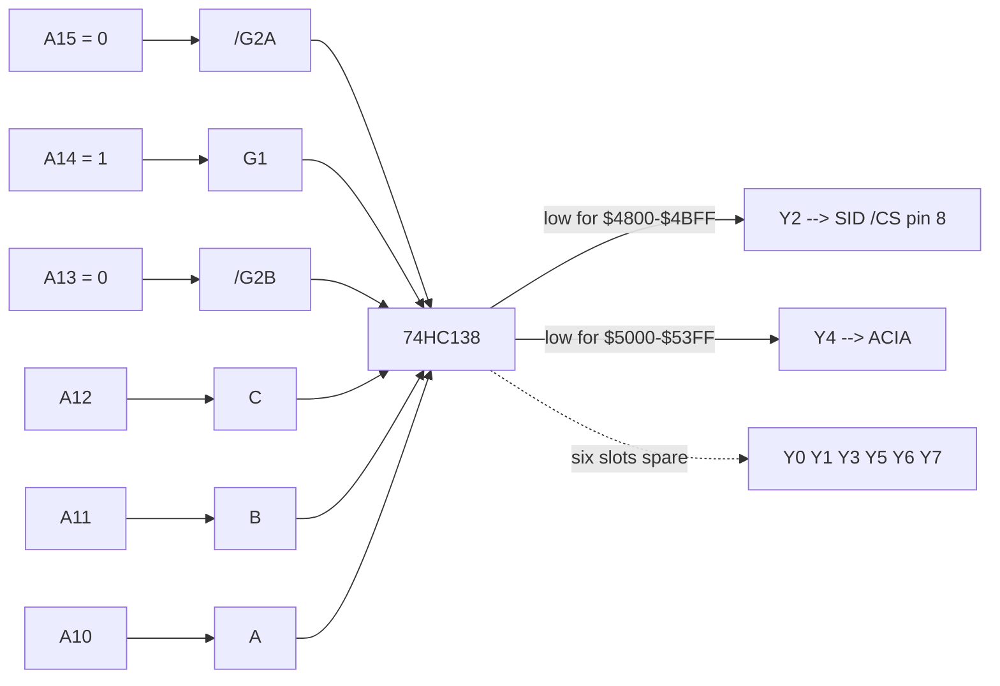

# BE6502 Build Notes — Memory Map & Address Decoding

Ben Eater 6502 (W65C02S) + Worlds Worst Video Card + Fast SD interface
+ W65C51 ACIA + **SIDKick pico at `$4800`**.

---

## Memory map

```
        +===========================================+
$FFFF   |                                           |
        |   ROM   28C256 EEPROM   32K               |
        |                                           |
        |     $F700  WozMon + Fast Binary Load      |
        |     $8000  Programstart                   |
$8000   |     $FFFA-$FFFF  NMI / RESET / IRQ vec    |
        +===========================================+
$7FFF   |   6522 VIA          16 regs, mirrored     |
$6000   |                     every $10 to $7FFF    |
        +===========================================+
$5FFF   |   I/O WINDOW        74HC138 enabled here  |
        |     8 x 1K slots  (see decoder below)     |
$4000   |     $4800 SID    $5000 ACIA               |
        +===========================================+
$3FFF   |                                           |
        |   RAM   62256 SRAM   16K decoded          |
        |                                           |
        |     $2000-$3FFF  display  128x64          |
        |                  (100x64 visible)         |
        |     $1F00-$1FFF  SD demo audio buffer     |
        |     $0300-$1EFF  free program space       |
        |     $0200-$02FF  WozMon input buffer      |
        |     $0100-$01FF  stack                    |
$0000   |     $0000-$00FF  zero page                |
        +===========================================+
```

RAM is enabled only when `A15=0 AND A14=0`, so **there is no RAM anywhere in
`$4000-$5FFF`** — the I/O window has the bus to itself, and reads from the SID
region do not contend.

### Zero page in use

| range | used by |
|---|---|
| `$0C` | VGAClock — decremented by the Vsync NMI handler |
| `$20-$2F` | WozMon (XAML, STL, MODE, MSGL, …) |
| `$A2-$AB` | SD command address, screen pointer, PORTA indirect |
| `$AE`, `$B1`, `$B2` | SD IRQ temp, screen pointer |
| `$EE`, `$EF` | serial echo temps |

Ported SID tunes load at `$1000` and the largest reaches `$25AF`, so music data
overlaps display RAM. Cosmetic noise only — the video card only reads.

---

## The 74HC138 I/O decoder

One chip generates every I/O chip select in `$4000-$5FFF`, using no extra glue.

### Enables gate the window

The 138 has three enable pins that must **all** be satisfied or every output
stays high:

| pin | polarity | wired to | requires |
|---|---|---|---|
| `G1` | active **high** | A14 | A14 = 1 |
| `/G2A` | active **low** | A15 | A15 = 0 |
| `/G2B` | active **low** | A13 | A13 = 0 |

`A15:A14:A13 = 010` is exactly `$4000-$5FFF`. Outside that range the decoder is
asleep and cannot assert anything — the range gate comes free from pins that
would otherwise be tied to rails.

### Selects slice the window

`C,B,A = A12,A11,A10` split the 8K window into eight 1K slots. Exactly one
output pulls low at a time:

| A12 | A11 | A10 | out | range | assigned |
|---|---|---|---|---|---|
| 0 | 0 | 0 | Y0 | `$4000-$43FF` | free |
| 0 | 0 | 1 | Y1 | `$4400-$47FF` | free |
| 0 | 1 | 0 | **Y2** | `$4800-$4BFF` | **SID /CS** |
| 0 | 1 | 1 | Y3 | `$4C00-$4FFF` | free |
| 1 | 0 | 0 | Y4 | `$5000-$53FF` | ACIA |
| 1 | 0 | 1 | Y5 | `$5400-$57FF` | free |
| 1 | 1 | 0 | Y6 | `$5800-$5BFF` | free |
| 1 | 1 | 1 | Y7 | `$5C00-$5FFF` | free |



### Mirroring

The SID decodes only `A0-A4` (32 registers) but Y2 is asserted across a full 1K.
Those 32 registers therefore repeat 32 times: `$4800`, `$4820`, `$4840` … all hit
the same register. `$4900` works too. Harmless, but nothing else can live in
`$4800-$4BFF`.

### No PHI2 gating

/CS is address-decode only, exactly like a C64's — the SID and the SIDKick pico
latch on the PHI2 edge themselves, so any glitch while the address bus settles
during PHI2 low is ignored. 138 propagation is ~20 ns, comfortable even at 5 MHz
(200 ns cycles).

---

## SIDKick pico wiring

Board is a 28-pin DIP footprint with **pins 1-4 unpopulated** — the SKpico
simulates the SID filter caps in firmware, so the 10-pin header is SID pins 5-14
and the 14-pin header is pins 15-28. The empty corner marks the pin-1 end.

| SID pin | signal | connect to |
|---|---|---|
| 5 | /RES | system reset (hold 5 s to cycle PHI2 timing configs) |
| 6 | φ2 | PHI2 clock — **1 MHz** |
| 7 | R/W | 6502 R/W |
| 8 | /CS | 74HC138 **Y2** |
| 9-13 | A0-A4 | address bus |
| 14 | GND | GND |
| 15-22 | D0-D7 | data bus |
| 25 | VCC | +5V |

Leave 23, 24, 26, 27, 28 unconnected. **Pin 28 (+12V) is not needed** and pin 27
audio out is inert unless you close the "L" solder jumper — don't. Audio comes
off the `GND-L-GND-R` line-out header on the PCB edge, into powered speakers.
Do not power the Pico from USB while it is powered from the breadboard.

### Clock speed

The SKpico wants C64-ish PHI2. At the Fast-SD build's 5 MHz it will not latch the
bus, and reSID is clocked from PHI2 so pitch would be 5x high regardless. Swap
the 1 MHz oscillator in for SID work; the SD hardware still runs at 1 MHz.

---

## Smoke tests

Chip select, no assembler required — type into WozMon:

```
4818: 0F
4805: 00 F0
4800: D6 1C 00 08 21
```

Continuous A4 sawtooth. Silence with `4804: 20`.

Read path (safe — no RAM at `$4800`): set voice 3 to noise, then examine `$481B`
repeatedly; OSC3 returns a different random byte each read.

```
480E: FF FF
4812: 80
```

---

## Loading software

`<addr>L` in WozMon starts the Fast Binary Load, then send the `.bin`.
`<addr>R` runs.

| what | load | run |
|---|---|---|
| `SIDSmokeTest.bin` | `300L` | `300R` |
| `MontyOnTheRun_BE6502_VIA50Hz.bin` | `400L` | `400R` |
| ported tunes — see `PORTED_TUNES.md` | `1000L` | varies |

---

## Timing: two ways to get 50 Hz

**`WAI` + IRQ** (`MontyOnTheRun_BE6502_VIA50Hz.asm`) — `SEI` keeps `I=1` so `WAI`
wakes on the IRQ line but resumes inline instead of vectoring into the ROM's
handler, which would never clear the VIA. `BIT T1C_L` after each wake clears the
flag; without it IRQB stays low and `WAI` falls straight through.
**`WAI` also wakes on NMI**, so a VGA Vsync on /NMI must be disconnected.

**Polled flag** (`PortSidToBE6502.py` output) — no interrupt is ever enabled:

```asm
BE6502_LOOP
	JSR play
-	BIT VIA_IFR        ; V flag <- bit 6 = T1 timed out
	BVC -
	BIT VIA_T1CL       ; reading T1C_L clears the flag
	JMP BE6502_LOOP
```

`BIT` drops IFR bit 6 straight into the V flag. No IRQ vector needed and a Vsync
on /NMI is harmless. This is the better default.

T1 value `19998` (`$4E1E`) → period `N+2` = 20000 cycles = 50.0 Hz at 1 MHz.
Halve it for 2x-speed tunes.
